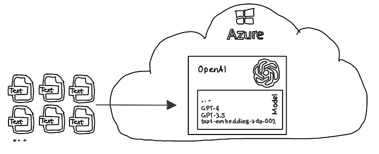
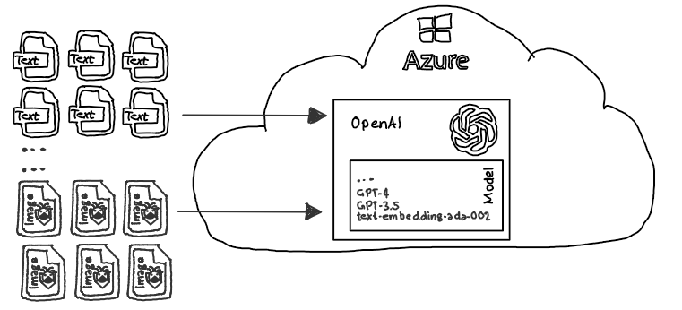
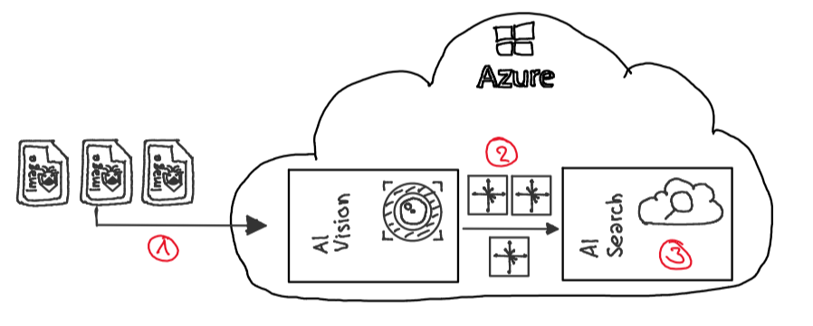
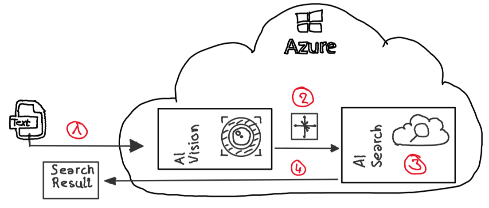

# AzureAI | AI Vision | Multimodal LLM

## Introduction

***LLMs (Large language Models)*** are primarily trained on textual data and excel at understanding and generating natural language. 

They demonstrate impressive performance on various Natural Language Processing (NLP) tasks, such as sentiment analysis, translation, and many other advanced tasks. Samples of LLMs are e.g.: OpenAI GPT 4.0, OpenAI GPT 3.5 Express, OpenAI text-embedding-ada-002, BERT, RoBERTa ... 

***MLLMs (Multimodal Large Language Models)*** extend LLMs by incorporating multi modal information, which can include e.g., text, images, audio, and other modalities.

These models can process both textual and visual data, making them more versatile and capable of handling a broader range of tasks. OCR on images or similar technologies aren't necessary to capture the semantic meaning of images when using MLLMs and align better with how humans naturally perceive the world through multisensory inputs.

## Azure AI Vision

[Azure AI Vision](https://learn.microsoft.com/en-us/azure/ai-services/computer-vision/overview) offers a powerful multi-modal [embedding functionality](https://learn.microsoft.com/en-us/azure/ai-services/computer-vision/how-to/image-retrieval). It generates numerical representations (vectors) for images, capturing their features and context and ***preserving the semantic meaning of the image***.

These vectors allow ***text-based search*** over the same vector space. By converting both images and text queries into vectors, it enables semantic matching between images and textual descriptions.

## Repo Content

### Overview

The contents of the repository exemplify how architecture diagrams, which are often found in software development, can be found and evaluated based on certain text based search criteria.

For this purpose, exemplary architecture diagrams that are available as images **(1)** are converted into embeddings (vectors) **(2)** with the help of Azure AI Vision. In this case, the semantic content of the images is preserved. The vectors can then be stored in any vector database **(3)**. In this repo, Azure AI Search (aka. Azure Cognitive Search).

After the vectors generated from the architecture diagrams have been saved in AI Search, they can be searched for with the help of text. For this purpose, the AI Vision Model is again used to create an embedding from the search term or terms **(1)**. This embedding **(2)** can in turn be used for a search in a vector database **(3)**, in this example Azure AI Search. The vector DB performs a search (e.g. cosine similarity) and provides **(4)** the results of the search.

### Folder Content

| Folder | Content | Details |
|---|---|---|
| [Architecture diagrams](./media/architecture/) | 4 sample architecture diagrams | To demonstrate the power of Azure AI Vision, freehand architectural drawings or drawings explaining a scenarios were provided.|
|[Resource creation](./src/create_env/CreateEnv.azcli)| Azure CLI script to create all necessary resources to run this demo | The CLI script is developed to run using PowerShell which is available on all major platforms|
|[Demo App](./src/app/MultiModalSample.ipynb)| Polyglot notebook | c# sample code with simple step by step guidance to execute the demo |
